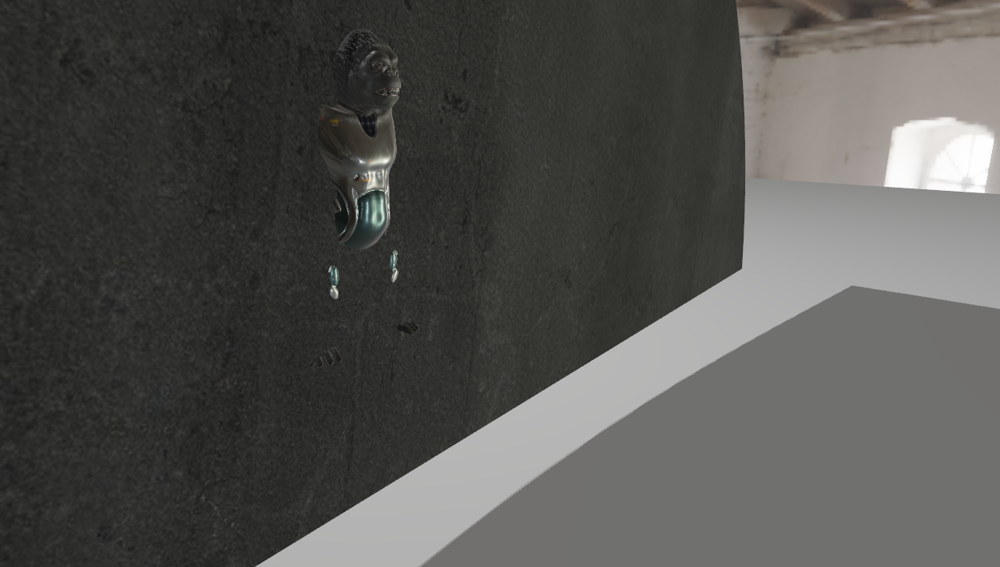

# toy-shader

## render result

## project framework

Assimp + glm + glfw + glad + Cmake 

## Render framework

PBR BRDF + Image-base Ambient Light + Shadow Map + HDR Tone Mapping + Defferred Render

## TODO

- SSAO
- default Material(pbr Texture)